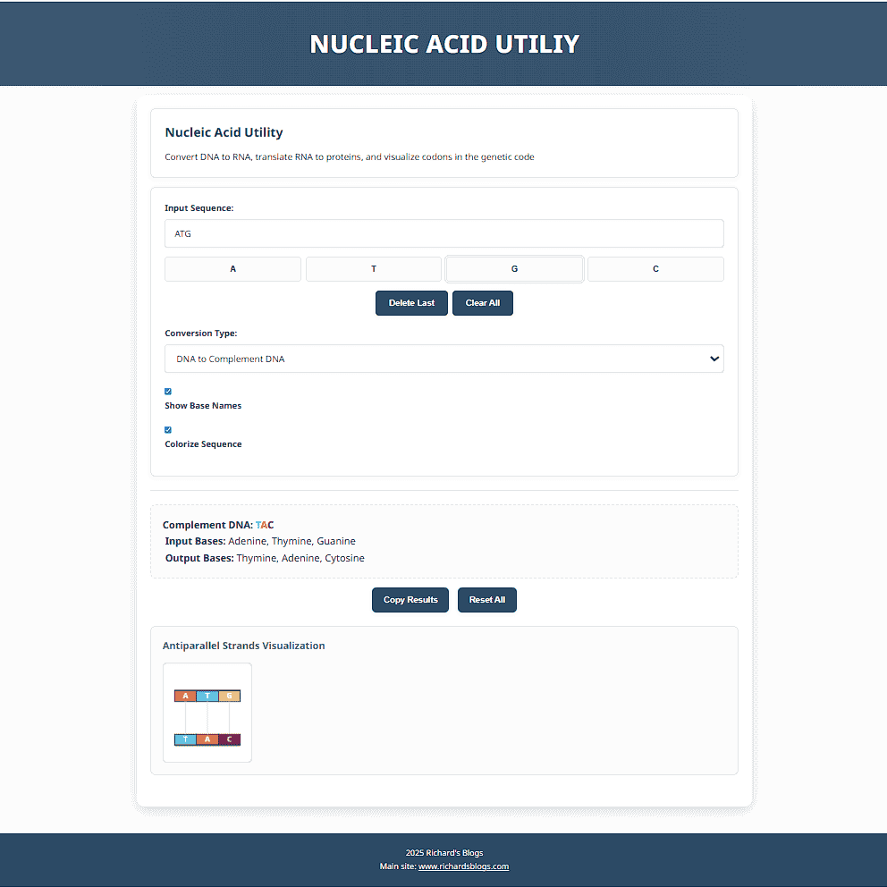
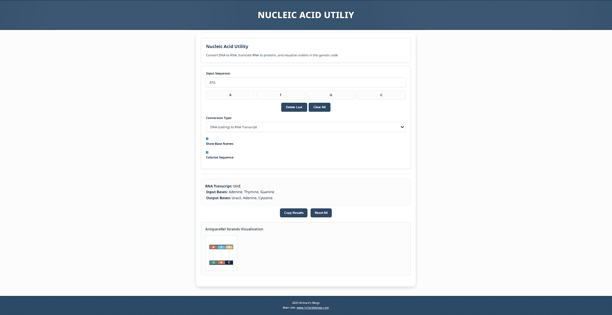
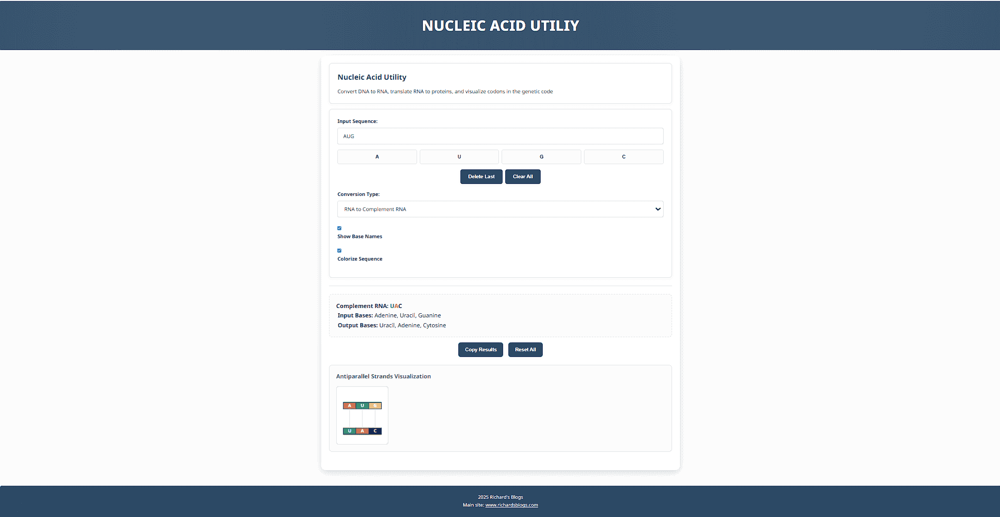
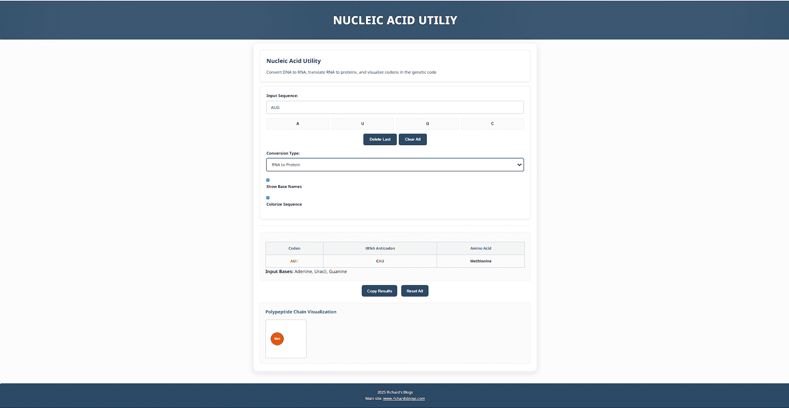
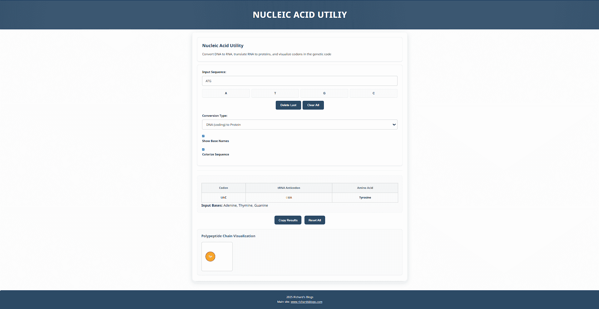

# Nucleic Acid Pairing and Protein Decoding available at [dna.richardsblogs.com](https://dna.richardsblogs.com)
> An interactive web application for exploring DNA and RNA sequences: convert between nucleic acids, compute complements and transcripts, and translate RNA (or coding‑strand DNA) into proteins.
## Table of Contents
* [Features](#features)
* [Demo](#demo)
* [Prerequisites](#prerequisites)
* [Installation & Usage](#installation--usage)
* [File Structure](#file-structure)
* [Customization](#customization)
* [License](#license)
---
## Features
* **Sequence Input**
  * Type or build a DNA/RNA sequence base by base with dedicated buttons.
  * Inline validation with visual error feedback on invalid characters.
* **Conversion Modes**
  * **DNA → Complementary DNA**
  * **DNA (coding strand) → RNA transcript**
  * **RNA → Complementary RNA**
  * **RNA → Protein translation**
  * **DNA (coding strand) → Protein translation**
* **Protein Decoding**
  * Standard genetic codon table for amino acid lookup.
  * Displays tRNA anticodons and full amino acid names.
* **Interactive Visualization**
  * Antiparallel strand diagram for DNA/RNA complement operations.
  * Polypeptide chain view for protein translations with hover tooltips.
  * Highlight, fade, and shake effects during sequence updates and errors.
* **UI Options**
  * Toggle full base‑name expansions (e.g., “Adenine, Thymine…”).
  * Toggle colorized base display.
  * Responsive design for desktop & mobile.
* **Lightweight & Accessible**
  * Built with plain HTML, CSS, and jQuery/UI.
  * Fastify static server serving files with `no-cache` headers.
---
## Demo
* Live demo: [dna.richardsblogs.com](https://dna.richardsblogs.com)
* Local preview: open your browser to `http://localhost:6001` after installation.
### Screenshots
| Operation                | Example                                                |
| ------------------------ | ------------------------------------------------------ |
| DNA → DNA Conversion     |          |
| DNA → RNA Conversion     |          |
| RNA → RNA Conversion     |          |
| RNA → Protein Conversion |  |
| DNA → Protein Conversion |  |
---
## Prerequisites
* [Node.js](https://nodejs.org/) **≥ v14**
* Internet access for CDN assets (automatic fallbacks to local copies included)
* Modern web browser with JavaScript enabled
---
## Installation & Usage
1. **Clone the repository**
   ```bash
   git clone https://github.com/richie-rich90454/nucleic-acid-utility.git
   cd nucleic-acid-utility
   ```
2. **Install dependencies**
   ```bash
   npm install
   ```
   This installs Fastify and its static plugin.
3. **Start the server**
   ```bash
   node server.js
   ```
   The app will start on port **6001** by default.
   Open your browser at → `http://localhost:6001`
---
## Customization
* **Styling**
  * Inline CSS is included in `index.html`. Extract into a separate stylesheet or override via external CSS.
* **Codon Table**
  * In `script.js`, edit the `codonTable` object to customize amino acid naming or support alternative genetic codes.
* **Server Settings**
  * Modify `server.js` to change ports, caching policies, or add custom routes.
* **Visualization**
  * Update canvas dimensions, colors, or animation in the `drawAntiparallelStrands` and `drawPolypeptideChain` functions.
---
## License
This project is licensed under the **MIT License**. See [LICENSE](LICENSE) for full details.
